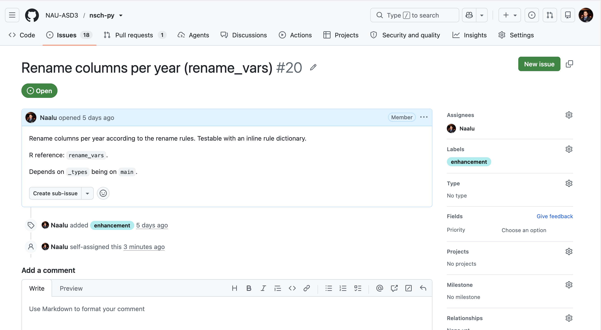
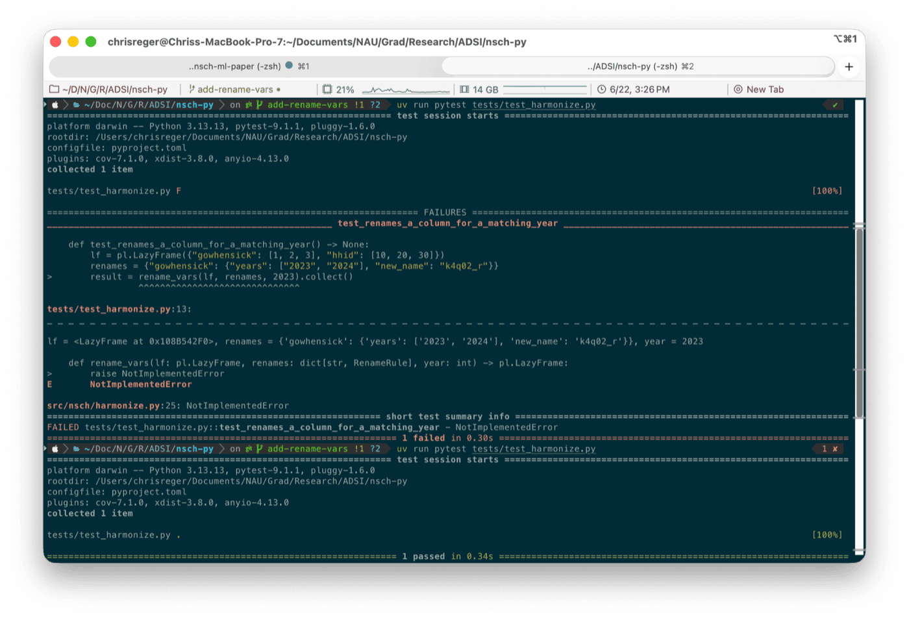
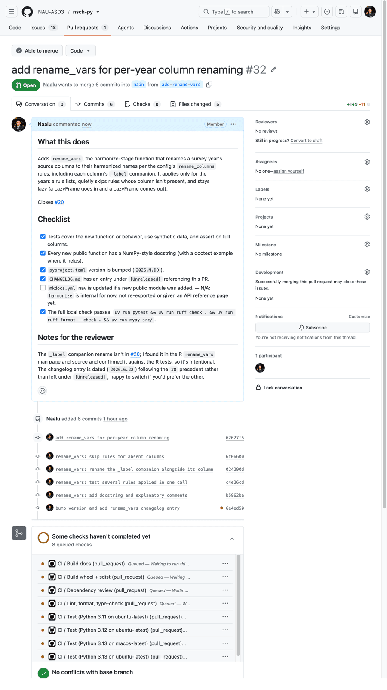
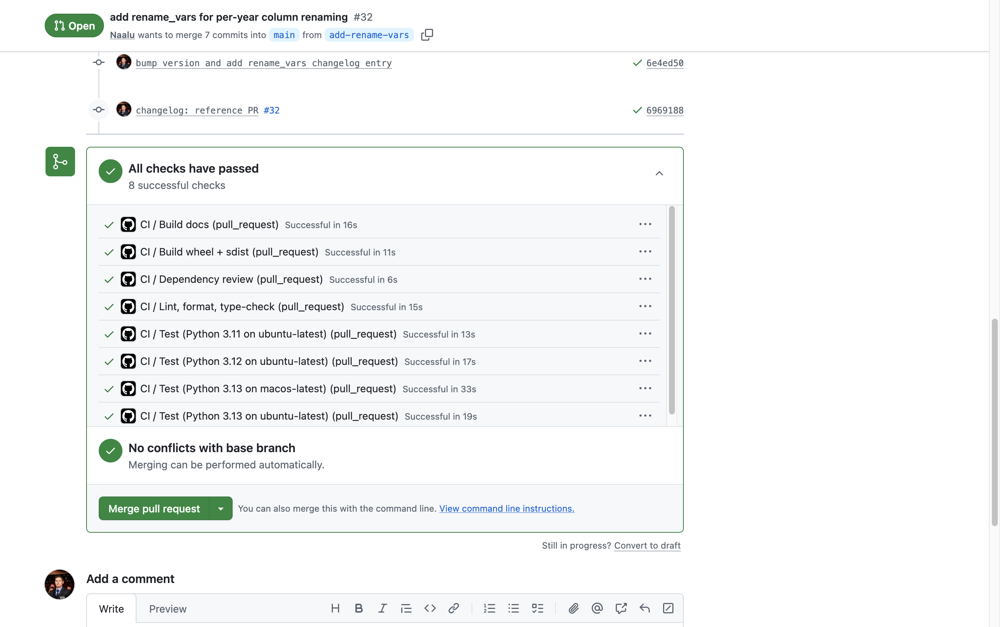

# Development walkthrough: from issue to merge

This is the routine I use to move a piece of work from an open issue to a merged pull request. I'm writing it the way I'd talk you through it sitting next to you, so you get not just the commands I run but what I'm thinking at each point and where I go looking when I'm not sure. The function in the example is small. The routine around it stays the same every time, so the routine is the thing to watch, even on a task this size.

I built this example for real while writing the page, so the screenshots and the errors are from that actual run rather than a tidied-up version of it. The task is issue #20, `rename_vars`, which renames a survey year's columns to the harmonized names the rest of the pipeline expects. Two of its neighbors, `transform_values` (#19) and `merge_vars` (#21), are nearly the same shape, so once this clicks you can run the same routine on either.

One note on the tools. We lean on Polars, uv, mypy, ruff, and pytest, and I explain each the first time it comes up. If a term flies past that you don't recognize, the "Where I look when I'm stuck" section at the end lists the docs I actually reach for.

---

## Contents

- [Before you follow along](#before-you-follow-along)
- [Step 1: Understand the issue, then claim it](#step-1-understand-the-issue-then-claim-it)
- [Step 2: Branch off a fresh main](#step-2-branch-off-a-fresh-main)
- [Step 3: Think it through before I write](#step-3-think-it-through-before-i-write)
- [Step 4: Write the code in red-green cycles](#step-4-write-the-code-in-red-green-cycles)
- [Step 5: One more test, the kind that guards](#step-5-one-more-test-the-kind-that-guards)
- [Step 6: Document it](#step-6-document-it)
- [Step 7: Run the full local gate](#step-7-run-the-full-local-gate)
- [Step 8: Version, changelog, and the lockfile](#step-8-version-changelog-and-the-lockfile)
- [Step 9: Push and open the pull request](#step-9-push-and-open-the-pull-request)
- [Step 10: Through CI, and into review](#step-10-through-ci-and-into-review)
- [Step 11: Merge, and back to a clean main](#step-11-merge-and-back-to-a-clean-main)
- [Where I look when I'm stuck](#where-i-look-when-im-stuck)
- [The loop, condensed](#the-loop-condensed)

---

## Before you follow along

To do this yourself you'll want the same setup I have, which is what the [CONTRIBUTING.md](https://github.com/NAU-ASD3/nsch-py/blob/main/CONTRIBUTING.md) guide walks through:

- the repo cloned,
- `uv sync --group dev` run at least once (uv is the tool that manages the project's Python environment and dependencies),
- `uv run pre-commit install` done (this wires up the checks that run automatically when you commit),
- and the [onboarding guide](onboarding.md) read.

The package installs in "editable" mode, which just means my installed copy points straight at my source files, so a new module is importable the moment I save it, no reinstall.

---

## Step 1: Understand the issue, then claim it

Before I put my name on anything, I take a few minutes to get oriented. Claiming an issue is a small promise to the team that I'll move it, so I'd rather find out now if it's blocked or bigger than it looks than halfway in.

**Where it fits in the big picture.** The first thing I do is place the issue in the pipeline. This package turns raw survey files into one harmonized table, and it gets there in stages: it downloads the files, reads them, loads the config, harmonizes each year, stacks the years together, and validates the result. `rename_vars` lives in the harmonize stage, which is the per-year work. Survey years don't always name the same variable the same way, so before I can stack 2016 next to 2024 I have to line their column names up. That's the whole job of `rename_vars`. It works on one year at a time and only touches column names, and its output feeds the step that stacks the years.

Two documents anchor that picture, and I keep both open while I work. I'd point a new co-worker at both on their first task.

The first is the [Architecture invariants section of CONTRIBUTING](https://github.com/NAU-ASD3/nsch-py/blob/main/CONTRIBUTING.md#architecture-invariants). These aren't style preferences, they're rules the whole package is built on, and the page is blunt that breaking one is a bug, not a nitpick. Three of them shape `rename_vars` directly. The pipeline is lazy from end to end, with a single `.collect()` that happens later inside `combine_years`, so my function has to take a LazyFrame and hand one back without collecting in the middle. Nothing mutates, so it returns a new frame rather than changing its input. And functions stay small and do one thing, under about fifty lines, which tells me `rename_vars` should rename and nothing else, leaving config-loading and collecting to other functions. The remaining two invariants, how Stata's missing-value codes are preserved and that config is loaded once as a typed model, matter less for a rename, but reading them is what makes names like `_types` and the eventual typed config click. Each invariant links out to [`design-decisions.md`](design-decisions.md) for the reasoning behind it. Reading these tells me the shape of the answer before I've written a line, which is why I spend the two minutes.

The second is the [R package this is a port of](https://github.com/NAU-ASD3/nsch). The Python package reimplements it, so the R code is the reference for what each piece is supposed to do. For now I'm just skimming. I read the README to refresh the overall flow, then open the `R/` folder, where the function files line up almost one-to-one with our pipeline stages, one of them `rename_vars.R`. Seeing my function already sitting there confirms where it belongs among its neighbors and tells me there's a reference I can check my behavior against once I get into the details. I'll come back to [`R/rename_vars.R`](https://github.com/NAU-ASD3/nsch/blob/main/R/rename_vars.R) in detail when I'm working out the types and behavior, because that original is the most reliable spec I have. Right now I'm just getting my bearings.

**A quick check for blockers.** Next I look for anything that would stop me cold, and I keep this fast. The issue itself flags a dependency on `_types`, so I check whether `_types` has actually landed on `main`. It has, that was PR #8, so I'm clear. I also scan the issue for "blocked by" links or comments, and I glance at the open pull requests to make sure nobody already has a branch in flight creating the same module. Nothing, so the path is open. While I'm scoping I make one mental note: renaming columns doesn't actually import anything from `_types`, so that flagged dependency won't really bite, but I confirmed the merge anyway instead of assuming. Trust the issue, but verify the thing that would block you.

**Do I actually understand it.** Last, I make sure I can say the job in one plain sentence: rename a year's columns to the harmonized names the config gives for that year. If I can't compress it to a sentence, I don't understand it well enough to claim it, and I keep reading. I also re-read the "Done when" checklist, since that's the closest thing I have to a spec and it's exactly what my reviewer will hold the PR against. I'm not trying to design the whole thing in my head at this point. I just want enough to know it's the right size and unblocked, and that I can picture what finished looks like.

Only then do I claim it. I open the issue, click the **Assignees** gear on the right, and put myself on it, which keeps anyone else from picking it up by accident.



---

## Step 2: Branch off a fresh `main`

This step is quick to run, but the last command leans on two ideas that are easy to take for granted if you've worked in Python projects before and confusing if you haven't. So before the commands, here's how I think about it.

**A mental model, if virtual environments are new to you.** By default, Python installs packages into one shared location, which means two projects on the same machine end up fighting over versions: one wants `polars` 1.40, another wants 1.41, and only one can win. A *virtual environment* solves that by giving each project its own private folder of installed packages, sealed off from everything else. I think of it as a dedicated toolbox for this one project, instead of dumping every project's tools into a single drawer where they clash. The *lockfile*, `uv.lock`, is the packing list for that toolbox: it records the exact version of every package, so when you, I, and the CI server each build our toolbox from it, we get an identical one. That's the thing that kills "but it works on my machine." The tool that reads the lockfile and assembles the toolbox is `uv`, and the part I like is that I never activate the environment by hand the old way; `uv run <command>` reaches into it for me. If this is new, the [uv docs](https://docs.astral.sh/uv/) are worth a read, and the [Locking and syncing](https://docs.astral.sh/uv/concepts/projects/sync/) page describes exactly what the commands below do.

**Getting onto a fresh branch.** Here's the sequence I run:

```bash
git checkout main
git pull
git checkout -b add-rename-vars
uv sync --group dev
```

I always start from a freshly pulled `main` so I'm building on current code, not whatever happened to be checked out last. That mattered today. The pull fast-forwarded my `main` and brought in the just-merged `_types` module, which is the dependency #20 had listed. I could see it land in the summary:

```
Fast-forward
 ...
 src/nsch/_types.py  | 71 ++++++++++++++++++++++++++++++++++++
 tests/test_types.py | 33 +++++++++++++++++
 ...
 create mode 100644 src/nsch/_types.py
```

Then I cut my branch, named for the work, `add-rename-vars`. (If the pull asks for an SSH passphrase, that's just your key unlocking; nothing unusual.)

The last command, `uv sync --group dev`, builds my toolbox to match the lockfile. The `--group dev` part adds the development tools (pytest, ruff, mypy) on top of the runtime dependencies. uv rebuilt the local `nsch` package and brought a couple of tools in line with what the lockfile pins, and I was set up to work.

**A wrinkle, and why I don't touch it.** Right after the sync, `git status` showed something I hadn't changed:

```
On branch add-rename-vars
Changes not staged for commit:
	modified:   uv.lock
```

I didn't edit the lockfile, so why is it modified? Because it was slightly out of date on `main`, and the sync corrected it. When `_types` merged, that PR bumped the project's own version in `pyproject.toml` but didn't refresh the lockfile to match, so the lock still recorded the previous version. My sync noticed the mismatch and fixed that one line. `git diff uv.lock` confirms it, the only change is the project's own recorded version:

```diff
 [[package]]
 name = "nsch"
-version = "2026.5.27"
+version = "2026.6.17"
 source = { editable = "." }
```

Nothing about my actual dependencies moved.

So what do I do with it? Nothing, for now. It's a real and correct change, but it has nothing to do with renaming columns, and reverting it would be pointless, since the next `uv` command would just reconcile it again. I leave it sitting in the working tree, and because I always stage files by name rather than `git add .`, it won't slip into my feature commits. The lockfile gets handled on purpose at the very end, when I bump the version for my own PR and refresh the lock deliberately. There's a small lesson hiding in this: the lock drifted because a version bump went in without a matching `uv lock`, which is exactly the bit of bookkeeping I'll be careful to get right in my own PR.

---

## Step 3: Think it through before I write

I don't open my editor yet. The expensive mistakes happen right here, in the gap between what I assume a function does and what it actually has to do, so I spend a few minutes reading before I type a single line.

**The issue is a starting point, not a spec.** Issue #20 gives me the gist, rename a year's columns to their harmonized names, but it's thin on the details that bite once I sit down to write. That's normal. An issue points at work; it isn't a precise specification. So I go find the real sources.

**The config tells me the shape of the data.** First I open the config the rules come from, [`variable-config.json`](https://github.com/NAU-ASD3/nsch/blob/main/inst/extdata/variable-config.json), and look at a `rename_columns` entry:

```json
"gowhensick": {
  "years": ["2023", "2024"],
  "new_name": "k4q02_r"
}
```

I'm checking the types, and there's a small surprise waiting: the years are in quotes. They're strings, not numbers, and so is `new_name`. In fact every value in this config is a string, even the ones that look numeric. That matters, because the `year` I get handed is an integer, so somewhere I'll have to compare an int against a list of strings.

**The man page is the spec I wish the issue had been.** For the actual behavior I pull up the documentation for the R function I'm porting, the [`rename_vars` man page](https://github.com/NAU-ASD3/nsch/blob/main/man/rename_vars.Rd). This is the source I lean on hardest. It's clearer than the issue and far easier to read than [the R source itself](https://github.com/NAU-ASD3/nsch/blob/main/R/rename_vars.R), which is the final word but slower going. And reading it, I picked up two things I would never have written from the issue alone:

> For each entry in `renames` whose `years` includes `as.character(year)`: renames the old column to `new_name` if it exists. Also renames the corresponding `_label` companion column if present. Silently skips entries whose old column is absent.

Both of those caught me a little off guard. The first is the "if it exists" and "silently skips entries whose old column is absent" part. I can't just rename whatever the rules name. A rule can point at a column that doesn't appear in this particular year's data, and the function has to quietly skip it rather than crash. So I have to check for existence before I rename. The second is the bigger one, and it's the kind of thing that's invisible until you read for it: "also renames the corresponding `_label` companion column if present." Every value column in this pipeline can have a sibling column holding its human-readable labels, named `<column>_label`. When I rename `gowhensick` to `k4q02_r`, I also have to rename `gowhensick_label` to `k4q02_r_label`, or the values and their labels quietly drift apart. Nothing in #20 says a word about that. If I'd worked from the issue alone, I'd have written a function that passes its first simple test and silently orphans every label column in the dataset.

That one find is the entire reason I read the reference before writing. The issue is where the work starts; the man page is where I learn what "done" actually means.

The man page settles two more things while I'm in there. It confirms the year comparison runs through `as.character(year)`, which is exactly the int-against-strings mismatch I spotted in the config, so in Python that becomes a `str(year)`. And it notes the R version modifies its table in place. Mine won't, because one of our invariants is that nothing mutates, so my version returns a new frame instead. That's the rule of thumb when I port: match the behavior, but follow our local conventions for how I get there.

With the behavior clear, I make a handful of decisions before I open the editor.

### What I'll call it

The name is already settled by the man page and the R source: `rename_vars`. When I port a function I keep its original name, so the two versions line up and anyone who knows one recognizes the other. Inside the function I name variables for what they hold rather than abbreviating them into a puzzle: a set called `present` for the columns actually in the frame, `year_str` for the year turned into text, `mapping` for the old-to-new pairs I'm assembling. Everything is lowercase with underscores, which is both the Python norm and our house style.

### The type for a rule

The man page describes the rules precisely: a list "keyed by old column name, each with `years` (character vector) and `new_name` (string)." That maps straight onto a Python type. A rule is a small record with two fixed keys, so I reach for a `TypedDict`, which is a dictionary whose keys and value types are known ahead of time:

```python
class RenameRule(TypedDict):
    years: list[str]
    new_name: str
```

I could leave the rules as a plain `dict`, but then nothing would catch me misspelling `new_name` or treating `years` as a single string instead of a list. With the `TypedDict`, the type checker knows `rule["new_name"]` is a `str` and `rule["years"]` is a `list[str]`, and it flags my mistake before the code ever runs. (These rules will eventually arrive from the config layer as validated objects. For now the `TypedDict` matches the shape I read in the config and is a light stand-in.)

### How big it should be

One of our invariants is that functions stay small and do one thing, ideally under 50 lines. `rename_vars` has exactly one job: apply this year's rename rules, labels included. It doesn't load the config and it doesn't collect the frame, because those are other functions' work. Keeping the job that narrow is what keeps the function short; the finished version is about a dozen lines.

### What I'll document

I decide this now so I don't skip it later. A short module docstring at the top of the file saying what the file is for. A docstring on the function in our [NumPy style](https://numpydoc.readthedocs.io/en/latest/format.html), with the parameters, the return, and one small runnable example. And two inline comments, one each for the choices a reader would otherwise stop and puzzle over: why I turn the year into a string, and why I rename the `_label` companion. I don't comment the obvious lines. A comment that just restates the code is clutter.

### What to test, and what not to

This is the part I slow down on, so if pytest is new to you, here's how I think about it from the ground up.

A test, in this project, is just a function whose name starts with `test_`, living in a file named `test_*.py` in the `tests/` folder. pytest finds them by those naming patterns and runs each one. Inside a test I do three things: build a small input, call the function, and check the result with a plain `assert`. If the assertion is false, the test fails and pytest prints what it got next to what I expected, which is usually enough to see the problem. There's no framework ceremony beyond that. I run the whole set with `uv run pytest`, or one file with `uv run pytest tests/test_harmonize.py`.

I name each test for the behavior it pins, in plain words: `test_renames_a_column_for_a_matching_year`, not `test_rename_1`. The payoff comes later, when a test goes red in CI and the name alone tells whoever's looking what broke, without opening the file. That only works if each test checks one behavior, so I keep them to one idea apiece.

I structure each test the same way. The input is a small synthetic frame I type out by hand, three to ten rows, never a real data file, so the test is fast and can't break for reasons outside my code. Because the function takes a lazy frame, I build a `pl.LazyFrame` for input and call `.collect()` on the result to turn that lazy recipe into real data I can read. And I assert on the whole column, `result["x"].to_list() == [1, 2, 3]`, rather than poking at a single cell like `result["x"][0]`, because checking one cell quietly ignores every row I didn't look at.

I write these in a red-green rhythm, and I'll say why, because it looks like extra work and isn't. I write the test first and run it, expecting it to fail. That red is doing a job: it proves the test actually exercises the thing I think it does. A test that passes before you've written the code is testing nothing. Then I write the smallest amount of code that turns it green, and move to the next test. Working this way forces me to decide what "correct" means in concrete terms before I'm tempted to call half-finished code done. It also leaves a working checkpoint to commit after every step, and it keeps me from over-building, since I only write code that some test asked for.

Now, which tests. The man page basically handed me the list, one per behavior it describes:

1. A column is renamed for a matching year. This is the core of it.
2. A non-matching year leaves the column untouched. This pins the year filter.
3. A rule naming a column that isn't there is skipped, not an error. This pins the existence check.
4. A renamed column's `_label` companion is renamed too. This pins the behavior I'd have missed without the man page.

That's four behaviors, one test each. Before I lock the list in, I do one more cross-check that's easy to skip and shouldn't be: I read how the R version is tested, in [`tests/testthat/test-rename_vars.R`](https://github.com/NAU-ASD3/nsch/blob/main/tests/testthat/test-rename_vars.R), and I walk through every assertion to be sure I'm not missing a case the original author thought worth pinning down.

Three of the four R tests map straight onto my plan. The non-matching-year test and the missing-column test are the same checks I'd already written down. And where the R tests use two assertions, one that the new name is present and one that the old name is gone, my habit of asserting the whole column list (`result.columns == [...]`) covers both in a single line, so I end up saying more in less. The R version also bundles the value rename and the label rename into one test; I keep mine split into two, one behavior apiece, which reads cleaner when one of them fails.

But the R label test asserts something mine didn't. After the rename, it checks that the renamed label column still holds its original values: `expect_identical(dt[["var1_new_label"]], c("Yes", "No"))`. Mine only checked that the column names came out right, not that the label data actually rode along under the new name. That's a real gap. With my rename-based approach it's hard to break, but the assertion makes the test check the whole behavior instead of half of it, and it would catch a future change that produced the right column name with the wrong data. So I add it, and my label test now asserts both the names and the values. Reading the reference's tests cost me two minutes and bought me an assertion I'd otherwise have shipped without, which is the whole reason to do it.

Just as important is what I leave out, because every test is code someone maintains forever, so each one has to earn its place by catching a real bug. I don't test that Polars' own `rename` works; that's Polars' job, and my tests are about the decisions my function makes, not the library under it. I don't write a "the input isn't mutated" test: it's true and it matters, but it's guaranteed by returning a new frame and never reassigning the input, so a test there would be checking Polars' behavior rather than a choice of mine. And I don't write an "empty rules dictionary changes nothing" test: the year and existence checks already handle the "nothing applies" case, and the absent-column test already runs the function with nothing to rename anyway, so a dedicated one would be upkeep for a case nothing realistically threatens. My rule of thumb is simple: if I can't name the specific bug a test would catch, I leave it out. (I'll reconsider one or two more tests once the function exists, in Step 5, but four is the plan going in.)

With all of that decided, the signature is fixed before I write the body:

```python
def rename_vars(lf: pl.LazyFrame, renames: dict[str, RenameRule], year: int) -> pl.LazyFrame: ...
```

This is the first function in a new module, `src/nsch/harmonize.py`, with its tests in `tests/test_harmonize.py`. I won't re-export it from `nsch/__init__.py` yet; we decide what the package makes available to import once there's more than one piece worth offering, and keeping this change to a single module keeps it easy to review.

---

## Step 4: Write the code in red-green cycles

Now I write the four tests I planned, one at a time, each followed by the smallest code that makes it pass. The rhythm is the one from Step 3: write a test, watch it fail, write just enough to make it pass, repeat. I commit when I reach a clean, working checkpoint, and as you'll see in a moment, the hooks help me decide where those checkpoints are.

### Cycle 1: rename a matching column

I start by creating `src/nsch/harmonize.py` with a placeholder body, so the import resolves and the test fails on behavior rather than on a missing name:

```python
"""Per-year column renaming for the harmonize stage.

``rename_vars`` applies the rename rules for one survey year, turning that
year's source column names into the harmonized names the rest of the pipeline
expects. It stays lazy: a LazyFrame goes in and a LazyFrame comes out, with no
collection.
"""

from __future__ import annotations

from typing import TYPE_CHECKING, TypedDict

if TYPE_CHECKING:
    import polars as pl

__all__ = ["RenameRule", "rename_vars"]


class RenameRule(TypedDict):
    years: list[str]
    new_name: str


def rename_vars(lf: pl.LazyFrame, renames: dict[str, RenameRule], year: int) -> pl.LazyFrame:
    raise NotImplementedError
```

Polars is imported under `if TYPE_CHECKING:` because the module only needs it for the type hints. The LazyFrame is handed to me already built, so nothing refers to `pl` when the code runs.

Then the first test, in `tests/test_harmonize.py`. The conventions from Step 3 are all here: a small `LazyFrame` built by hand, a `.collect()` at the end to turn the lazy recipe into real data, and an assertion on the whole column. I use a real rename from the config, `gowhensick` becoming `k4q02_r` in 2023, so I can check it against the file:

```python
"""Tests for the harmonize module."""

from __future__ import annotations

import polars as pl

from nsch.harmonize import RenameRule, rename_vars


def test_renames_a_column_for_a_matching_year() -> None:
    lf = pl.LazyFrame({"gowhensick": [1, 2, 3], "hhid": [10, 20, 30]})
    renames: dict[str, RenameRule] = {
        "gowhensick": {"years": ["2023", "2024"], "new_name": "k4q02_r"}
    }
    result = rename_vars(lf, renames, 2023).collect()
    assert result.columns == ["k4q02_r", "hhid"]
    assert result["k4q02_r"].to_list() == [1, 2, 3]
```

One detail in that test: I annotate `renames` as `dict[str, RenameRule]`. Without it, my editor's type checker reads the bare literal as a plain nested dictionary and flags it as not matching the rule type, since a regular `dict` and a `TypedDict` aren't interchangeable to a strict checker. The annotation tells it the inner dictionaries really are rename rules. (The type gate only checks `src/`, not the tests, so this never blocks CI, but I keep the tests type-clean anyway.)

I run it expecting red:

```
tests/test_harmonize.py F
>       raise NotImplementedError
E       NotImplementedError
1 failed in 0.30s
```

That red is doing a job. It proves the test actually reaches my function rather than passing by accident. Now the smallest code that makes it pass, dropped in where `raise NotImplementedError` was:

```python
    mapping: dict[str, str] = {}
    for old, rule in renames.items():
        mapping[old] = rule["new_name"]
    return lf.rename(mapping)
```

```
tests/test_harmonize.py .
1 passed in 0.34s
```

Green. It works, but I know it isn't finished: it renames every rule's column no matter the year. I try to commit anyway, and the hooks stop me:

```bash
git add src/nsch/harmonize.py tests/test_harmonize.py
git commit -m "add rename_vars with matching-year rename"
```

```
[INFO] Stashing unstaged files to ...
trim trailing whitespace.................................................Passed
fix end of files.........................................................Passed
check for merge conflicts................................................Passed
ruff.....................................................................Failed
- hook id: ruff
- exit code: 1

src/nsch/harmonize.py:24:67: ARG001 Unused function argument: `year`

ruff-format..............................................................Passed
mypy.....................................................................Passed
```

This is the linter earning its keep. My naive version ignores the `year` argument entirely, so ruff flags it as unused and pre-commit refuses the commit. It's right to. A rename function that ignores the year isn't done, and I don't want a half-finished version on the record. That unused-argument complaint isn't a nuisance, it's a signpost pointing me at the next behavior: only rename when the year matches. So I don't argue with it, I move to cycle 2, which adds exactly that, and the commit lands there instead.

Two small things in that log are worth a glance. Pre-commit stashed my still-unstaged `uv.lock`, the lockfile change left over from Step 2, before running the hooks, so they only saw what I actually staged. And every other check passed, the formatter, mypy, the whitespace and end-of-file fixers, so the one and only thing standing between me and a commit was that single unused argument.



### Cycle 2: leave non-matching years alone

The second test pins the behavior the naive version gets wrong, so I write it next:

```python
def test_leaves_columns_unchanged_for_a_nonmatching_year() -> None:
    lf = pl.LazyFrame({"gowhensick": [1, 2, 3]})
    renames: dict[str, RenameRule] = {
        "gowhensick": {"years": ["2023", "2024"], "new_name": "k4q02_r"}
    }
    # 2016 isn't in the rule's years, so the column keeps its source name.
    result = rename_vars(lf, renames, 2016).collect()
    assert result.columns == ["gowhensick"]
```

I run it, and test 2 goes red while test 1 stays green:

```
tests/test_harmonize.py .F
>       assert result.columns == ["gowhensick"]
E       AssertionError: assert ['k4q02_r'] == ['gowhensick']
1 failed, 1 passed in 0.38s
```

That failure tells me exactly what's missing: my code renamed `gowhensick` even though 2016 isn't in the rule's years. So I add the year filter. The rule's `years` are strings and `year` comes in as an integer, the gap I found in the config, so I compare on `str(year)`, written as an early `continue` that skips any rule whose year doesn't match:

```python
    year_str = str(year)
    mapping: dict[str, str] = {}
    for old, rule in renames.items():
        if year_str not in rule["years"]:
            continue
        mapping[old] = rule["new_name"]
    return lf.rename(mapping)
```

Both green:

```
tests/test_harmonize.py ..
2 passed in 0.35s
```

And now that `year` actually does something, the commit goes through, every hook passing:

```bash
git add src/nsch/harmonize.py tests/test_harmonize.py
git commit -m "add rename_vars for per-year column renaming"
```

```
ruff.....................................................................Passed
ruff-format..............................................................Passed
mypy.....................................................................Passed
[add-rename-vars 62627f5] add rename_vars for per-year column renaming
 2 files changed, 58 insertions(+)
```

That's my first real commit on the branch: a working slice that renames scoped to the right year. The existence check and the label companion are still ahead.

### Cycle 3: skip absent columns

The third test points at a case the function can't handle yet, a rule that names a column which isn't in this year's data:

```python
def test_ignores_rules_for_columns_that_are_absent() -> None:
    lf = pl.LazyFrame({"hhid": [10, 20, 30]})
    renames: dict[str, RenameRule] = {"gowhensick": {"years": ["2023"], "new_name": "k4q02_r"}}
    result = rename_vars(lf, renames, 2023).collect()
    assert result.columns == ["hhid"]
```

This red is a different kind. It isn't an assertion that fails, it's an exception. Asking Polars to rename a column that isn't there stops the query cold:

```
>       result = rename_vars(lf, renames, 2023).collect()
E       polars.exceptions.ColumnNotFoundError: "gowhensick" not found
E
E       Resolved plan until failure:
E       	---> FAILED HERE RESOLVING THIS_NODE <---
E       DF ["hhid"]; PROJECT */1 COLUMNS
1 failed, 2 passed in 0.41s
```

Real configs carry rules for variables that don't appear in every year, so the function has to skip those instead of crashing. The fix is a presence check. A lazy frame has no cheap `.columns` to read, since it hasn't computed anything yet, so I ask the schema for the names with `collect_schema()`, which works out the column names without touching the data, and I fold that check into the same `continue` that already skips non-matching years:

```python
    present = set(lf.collect_schema().names())
    year_str = str(year)
    mapping: dict[str, str] = {}
    for old, rule in renames.items():
        if year_str not in rule["years"] or old not in present:
            continue
        mapping[old] = rule["new_name"]
    return lf.rename(mapping)
```

All three green:

```
tests/test_harmonize.py ...
3 passed in 0.31s
```

Commit:

```bash
git add src/nsch/harmonize.py tests/test_harmonize.py
git commit -m "rename_vars: skip rules for absent columns"
```

```
[add-rename-vars 6f06600] rename_vars: skip rules for absent columns
 2 files changed, 9 insertions(+), 1 deletion(-)
```

### Cycle 4: rename the label companion too

This is the behavior I found in the man page, the one #20 never mentions. The test sets up a column with its `_label` sibling and asserts both that the names come out right and that the renamed label column still holds its values, the value assertion I added after reading the R tests:

```python
def test_renames_the_label_companion_too() -> None:
    lf = pl.LazyFrame({"gowhensick": [4, 8], "gowhensick_label": ["Clinic", "Other"]})
    renames: dict[str, RenameRule] = {"gowhensick": {"years": ["2023"], "new_name": "k4q02_r"}}
    result = rename_vars(lf, renames, 2023).collect()
    assert result.columns == ["k4q02_r", "k4q02_r_label"]
    assert result["k4q02_r_label"].to_list() == ["Clinic", "Other"]
```

Run it, and it goes red: the value column renames, but its label is left behind, so the second column comes back as `gowhensick_label`:

```
>       assert result.columns == ["k4q02_r", "k4q02_r_label"]
E       AssertionError: assert ['k4q02_r', 'gowhensick_label'] == ['k4q02_r', 'k4q02_r_label']
E         At index 1 diff: 'gowhensick_label' != 'k4q02_r_label'
1 failed, 3 passed in 0.39s
```

I add the companion handling inside the loop, right after recording the main rename. When a column gets renamed, I look for its `<old>_label` sibling and rename it to match:

```python
    present = set(lf.collect_schema().names())
    year_str = str(year)
    mapping: dict[str, str] = {}
    for old, rule in renames.items():
        if year_str not in rule["years"] or old not in present:
            continue
        new_name = rule["new_name"]
        mapping[old] = new_name
        old_label = f"{old}_label"
        if old_label in present:
            mapping[old_label] = f"{new_name}_label"
    return lf.rename(mapping)
```

All four green:

```
tests/test_harmonize.py ....
4 passed in 0.34s
```

Commit:

```bash
git add src/nsch/harmonize.py tests/test_harmonize.py
git commit -m "rename_vars: rename the _label companion alongside its column"
```

```
[add-rename-vars 024290d] rename_vars: rename the _label companion alongside its column
 2 files changed, 13 insertions(+), 1 deletion(-)
```

That's the whole logic, and every line of it exists because a specific test asked for it. One last thing worth noticing about the shape of the code. Early on, a one-line dictionary comprehension would have done the job. By this cycle each rule can add two entries to the mapping, the column and its label, which a comprehension can't express without contorting. The plain loop with a guard stays readable as the logic grows, so it was the right shape to settle on. That's a normal call to make: reach for the simple tool first, and switch when the simple tool starts fighting you.

---

## Step 5: One more test, the kind that guards

With the function working, I ask whether any further test earns its keep. Not every test that can be written should be, since each one is code someone maintains forever, so it has to pay for itself.

One does. Real configs apply many rules at once, and every test so far uses a single rule. A test with two rules in one call documents that intent and protects the multi-rule path against a future change that quietly breaks it:

```python
def test_applies_several_rules_in_one_call() -> None:
    lf = pl.LazyFrame({"gowhensick": [1], "family_r": [2], "hhid": [3]})
    renames: dict[str, RenameRule] = {
        "gowhensick": {"years": ["2023"], "new_name": "k4q02_r"},
        "family_r": {"years": ["2023"], "new_name": "family"},
    }
    result = rename_vars(lf, renames, 2023).collect()
    assert result.columns == ["k4q02_r", "family", "hhid"]
```

The thing to notice is that it passes the moment I write it:

```
tests/test_harmonize.py .....
5 passed in 0.36s
```

No red. That's the difference between a test that drives behavior into existence and one that guards behavior already there. Cycles 1 through 4 each went red first, because each pulled in a piece the code didn't have. This one stays green because the loop already handles any number of rules. Both kinds are worth having, for different reasons. I commit it on its own, since it touches only the test file:

```bash
git add tests/test_harmonize.py
git commit -m "rename_vars: test several rules applied in one call"
```

```
mypy.................................................(no files to check)Skipped
[add-rename-vars c4e26cd] rename_vars: test several rules applied in one call
 1 file changed, 10 insertions(+)
```

mypy reports nothing to check there, since the gate runs it on `src/` and this commit touched only a test.

---

## Step 6: Document it

I planned the documentation back in Step 3, and now I write it. This is the part that's easiest to skip and shouldn't be: the example in the docstring is the fastest way for the next person to see what the function does, and it doubles as a check.

The logic doesn't change here. I add three docstrings and three comments. The module docstring gains a sentence about the `_label` companion. `RenameRule` gets a one-line docstring. The function gets a full NumPy-style docstring with a runnable example. And I add the why-comments: the two I planned in Step 3 (the string-year comparison and the `_label` companion) plus a third that the implementation turned up, explaining why I read the schema instead of the columns. Here's the finished module:

```python
"""Per-year column renaming for the harmonize stage.

``rename_vars`` applies the rename rules for one survey year, turning that
year's source column names into the harmonized names the rest of the pipeline
expects. It stays lazy: a LazyFrame goes in and a LazyFrame comes out, with no
collection. When a column is renamed, its ``_label`` companion is renamed to
match, so the value column and its human-readable labels stay paired.
"""

from __future__ import annotations

from typing import TYPE_CHECKING, TypedDict

if TYPE_CHECKING:
    import polars as pl

__all__ = ["RenameRule", "rename_vars"]


class RenameRule(TypedDict):
    """One rename rule: the years it applies to, and the harmonized name."""

    years: list[str]
    new_name: str


def rename_vars(lf: pl.LazyFrame, renames: dict[str, RenameRule], year: int) -> pl.LazyFrame:
    """Rename columns for one survey year according to the rename rules.

    Parameters
    ----------
    lf : pl.LazyFrame
        One year's data, before renaming.
    renames : dict[str, RenameRule]
        Maps a source column name to its rule. A rule applies only when ``year``
        is in the rule's ``years``.
    year : int
        The survey year ``lf`` holds. Compared against each rule's ``years``,
        which the config stores as strings.

    Returns
    -------
    pl.LazyFrame
        The frame with matching columns renamed, each column's ``_label``
        companion renamed alongside it. Columns with no applicable rule, and
        rules naming a column that isn't present, are left alone.

    Examples
    --------
    >>> import polars as pl
    >>> lf = pl.LazyFrame({"gowhensick": [4, 8]})
    >>> rule = {"gowhensick": {"years": ["2023"], "new_name": "k4q02_r"}}
    >>> rename_vars(lf, rule, 2023).collect().columns
    ['k4q02_r']
    """
    # A LazyFrame has no cheap `.columns`; ask the schema for the names.
    present = set(lf.collect_schema().names())
    # The config stores years as strings; `year` arrives as an int.
    year_str = str(year)
    mapping: dict[str, str] = {}
    for old, rule in renames.items():
        if year_str not in rule["years"] or old not in present:
            continue
        new_name = rule["new_name"]
        mapping[old] = new_name
        # A column's labels live in `<name>_label`; rename them together.
        old_label = f"{old}_label"
        if old_label in present:
            mapping[old_label] = f"{new_name}_label"
    return lf.rename(mapping)
```

Each comment explains a choice a reader would otherwise stop and puzzle over, and there's none on a line like `return lf.rename(mapping)`, because the code already says it.

The normal test run doesn't execute doctests, so I check the example by hand:

```bash
uv run pytest --doctest-modules src/nsch/harmonize.py
```

```
src/nsch/harmonize.py .
1 passed in 0.34s
```

Then the whole suite, to make sure nothing drifted:

```bash
uv run pytest
```

```
tests/test_harmonize.py .....
tests/test_smoke.py ..
tests/test_types.py ....
11 passed in 0.28s
```

That last run is a quiet reminder that my five tests live alongside the rest of the project's, eleven in all, and they pass together. Commit:

```bash
git add src/nsch/harmonize.py
git commit -m "rename_vars: add docstring and explanatory comments"
```

```
[add-rename-vars b5862ba] rename_vars: add docstring and explanatory comments
 1 file changed, 35 insertions(+), 1 deletion(-)
```

The function is done: implemented, tested, and documented.

---

## Step 7: Run the full local gate

Before I think about a pull request, I run the same battery the automated checks run, chained so it stops at the first failure:

```bash
uv run pytest && uv run ruff check . && uv run ruff format --check . && uv run mypy src/
```

Four tools, each with a job. `pytest` runs the whole suite. `ruff check .` is the linter, and the `.` means it covers the tests too, not just `src/`. `ruff format --check .` confirms formatting without changing anything; if it ever reports that a file would be reformatted, I run `uv run ruff format .` and let the tool fix it rather than hand-editing. `mypy src/` checks the types on the package source.

```
11 passed in 0.37s
All checks passed!
7 files already formatted
Success: no issues found in 3 source files
```

A green run here is the real gate. If this passes, the checks on the PR almost certainly pass too. Everything's clean, so I'm ready to do the bookkeeping and open the PR.

---

## Step 8: Version, changelog, and the lockfile

Every code PR here carries a little bookkeeping, and I do it deliberately at the end rather than scattering it through the work. Three edits.

**The version.** In `pyproject.toml` I set the version to today's date in `YYYY.M.DD` form, bumping `2026.6.17` to `2026.6.22`.

**The changelog.** We follow [Keep a Changelog](https://keepachangelog.com/), and because every PR here is effectively a dated release, I stamp mine on the way out. The top of `CHANGELOG.md` has an empty `## [Unreleased]` heading above the previous release. I add my dated section between them and leave `[Unreleased]` empty for the next person:

```markdown
## [Unreleased]

## [2026.6.22] - 2026-06-22

- Added `rename_vars` for per-year column renaming (#NN)
```

The header date matches the version I just set. I don't know the PR number yet, so I leave `#NN` as a placeholder and fix it once the PR exists.

**The lockfile.** Bumping the version changes the project's own recorded version, so the lock is now a step behind. I refresh it:

```bash
uv lock
```

```
Updated nsch v2026.6.17 -> v2026.6.22
```

This is also where the `uv.lock` change I left alone back in Step 2 finally gets resolved on purpose: that stale line is now set to my version. I commit all three files together:

```bash
git add pyproject.toml CHANGELOG.md uv.lock
git commit -m "bump version and add rename_vars changelog entry"
```

```
[add-rename-vars 6e4ed50] bump version and add rename_vars changelog entry
 3 files changed, 27 insertions(+), 11 deletions(-)
```

One small tell that the lockfile is finally settled: this commit ran without the "stashing unstaged files" note every earlier commit showed. Since Step 2 there had been a modified `uv.lock` sitting in the working tree, and pre-commit stashed it each time so the hooks only saw what I'd staged. Now that it's staged and committed, there's nothing left to stash.

---

## Step 9: Push and open the pull request

My branch now holds a handful of small, working commits. I push it and set the upstream:

```bash
git push -u origin add-rename-vars
```

GitHub prints a link, and the repo page shows a "Compare & pull request" button. I click it, and the template fills the description for me. I work through it:

- A sentence or two on what the PR does.
- `Closes #20`, which links the PR to the issue and closes the issue automatically when this merges.
- The checklist. I check what applies and leave a short note next to anything that doesn't, rather than deleting it. The mkdocs nav box stays unchecked here, with a note that `harmonize` is internal for now and has no API reference page to slot into. Leaving it unchecked with a reason tells the reviewer I considered it, instead of looking like I missed it.
- The reviewer notes. I flag the two judgment calls up front: the `_label` companion behavior, which isn't in the issue so the reviewer should know it's deliberate and checked against the R reference, and the dated changelog entry. Surfacing those is the kind of thing that saves a review round-trip.

This isn't a stacked PR, it branches off `main`, so I ignore the stacked-PR note at the top of the template. I set the base branch to `main` and create it.



---

## Step 10: Through CI, and into review

Once the PR is open, the automated checks run: the same checks as my local gate, plus the test matrix across Python 3.11 through 3.13, the package build, the docs build, and dependency-review. I watch the Checks section at the bottom of the PR. Mine came back green.

Now that the PR has a number, I fix the changelog placeholder. I change `(#NN)` to `(#32)`, commit, and push:

```bash
git add CHANGELOG.md
git commit -m "changelog: reference PR #32"
git push
```

The PR picks up the new commit and re-runs its checks. I don't open a new PR for a change like this; pushing to the same branch updates the open one.

Then I request review, which is one click on the Reviewers gear on the right of the PR. My own PRs go to Toby or Ben. If you're working through your first issues from this walkthrough, add me as a reviewer, so I can read your code with you and explain the reasons behind the conventions you've been following here.

When a reviewer leaves comments, I treat each as either "I'll change this" or "here's why I did it this way," and I reply to each one. Any code changes go to the same branch, and the PR updates itself. This back-and-forth is the normal shape of review and where a lot of the learning happens, so I don't read requested changes as a bad grade.



---

## Step 11: Merge, and back to a clean main

Once the PR is approved and every check is green, it gets merged. On this team I do the merge myself once a reviewer has signed off. The `Closes #20` line closes the issue automatically, and GitHub offers a button to delete the branch right after merging, which I take, since the work is on `main` now and the branch has done its job.

Then I return to `main` on my own machine and pull, so my local copy has the merged work before I start the next thing:

```bash
git checkout main
git pull
```

That's the whole loop, start to finish. The function is on `main`, the issue is closed, and the next person who pulls has it.

---

## Where I look when I'm stuck

Getting stuck is normal, and knowing where to look is most of the skill. Roughly in the order I reach for them:

- **The R package** ([NAU-ASD3/nsch](https://github.com/NAU-ASD3/nsch)). This is the source of truth for behavior, since the Python package is a port of it. When the issue is thin, I read the man page for the function I'm porting, then the R source in `R/`, then the config in `inst/extdata/`, and the R tests in `tests/testthat/`. That's where I found the `_label` companion and the existence check that #20 never mentioned.
- **The Polars docs** ([docs.pola.rs](https://docs.pola.rs/)). For when I know what I want to do to the data but not how to say it. This is where `collect_schema` came from, when I needed the column names off a lazy frame.
- **The uv docs** ([docs.astral.sh/uv](https://docs.astral.sh/uv/)). For anything about the environment, the dependencies, or the lockfile, including the [Locking and syncing](https://docs.astral.sh/uv/concepts/projects/sync/) page when a sync does something I didn't expect.
- **The mypy and ruff docs** ([mypy](https://mypy.readthedocs.io/), [ruff](https://docs.astral.sh/ruff/)). When the type checker or linter prints a code I don't recognize, like `ARG001`, I search it in their docs for the explanation and the fix.
- **The pytest docs** ([docs.pytest.org](https://docs.pytest.org/)) and the [numpydoc style guide](https://numpydoc.readthedocs.io/en/latest/format.html). For test mechanics and the docstring format.
- **The internal docs.** `CONTRIBUTING.md` for the conventions and the architecture invariants, the onboarding guide for setup, and `design-decisions.md` for why things are built the way they are.
- **The code already here.** `_types.py` and the sibling harmonize functions are the closest examples of house style. When in doubt, I copy the shape of what's already merged.
- **The team.** If I've looked and I'm still stuck, I ask in the PR or the issue, with what I tried and what happened. A specific question gets a fast answer and is never an imposition. Sitting stuck in silence is the only wrong move.

---

## The loop, condensed

1. Claim the issue: place it in the pipeline, confirm nothing's blocking it, and make sure I can say the job in one sentence.
2. Branch off a freshly pulled `main`. One branch, one issue.
3. Think it through before writing: the issue is a starting point, so I read the config and the man page, then settle the name, the types, the size, the documentation, and the tests.
4. Red-green, one behavior per cycle: a failing test, the smallest code that passes, and a commit at each clean checkpoint.
5. Add only the further tests that catch a real risk; skip the ones that don't.
6. Write the docstring with a runnable example, and verify it with `--doctest-modules`.
7. Run the full local gate, and let the formatter do the formatting.
8. Bump the version, stamp the changelog, and refresh the lockfile with `uv lock`.
9. Push, open the PR, fill the template, and write `Closes #N`.
10. Green checks, fix the changelog number, request review.
11. Approved and green, merge, then return to `main` and pull.

Every box in the PR checklist maps to a step above. Do the steps, and the checklist fills itself in.
